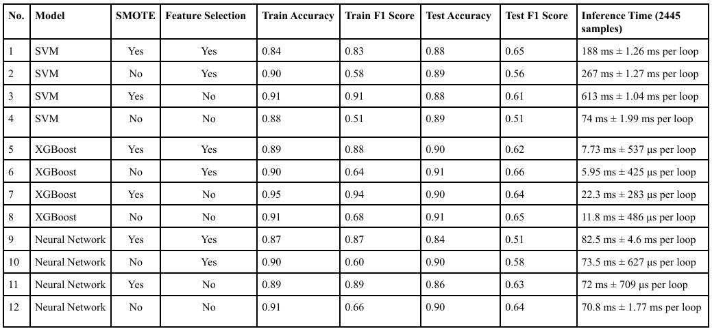

# masters-research-project

# Optimisation of Machine Learning Models for Prediction in E-Commerce

This repository contains all files and experiments relating to a comparative study of Support Vector Machines, Boosting (XGBoost), and Neural Networks. The goal is to predict online shoppers’ purchase intentions and examine both predictive performance and inference times in a production context. The impact of feature selection was explored as well. This project is part of the University of Hertfordshire MSc Data Science programme.

---

## Project Overview

The main research question is: **In e-commerce, how do SVMs, Boosting, and Neural Networks compare in their ability in terms of accuracy & inference efficiency in the prediction of shoppers purchase intention online, when the model is used in production? How does the application of feature selection impact performance?**

Please refer to the submitted report on Canvas for more details of the entire project.

---

## Project Structure

Below is a brief description of folders and key files in this repository:

├── .git
├── .ipynb_checkpoints
├── archive
├── datasets
│   ├── 1. online_shoppers_intention.csv
│   ├── 2. online_shoppers_intention_dirty.csv
│   ├── 3. online_shoppers_intention_clean.csv
├── .gitignore
├── 0.5 install_libraries.ipynb
├── 1. load_data_make_dirty.ipynb
├── 2. data_cleaning.ipynb
├── 3. eda.ipynb
├── 4. Experiment 1 (SVM).ipynb
├── 5. Experiment 2 (SVM).ipynb
├── 6. Experiment 3 (SVM).ipynb
├── 7. Experiment 4 (SVM).ipynb
├── 8. Experiment 5 (Boosting).ipynb
├── 9. Experiment 6 (Boosting).ipynb
├── 10. Experiment 7 (Boosting).ipynb
├── 11. Experiment 8 (Boosting).ipynb
├── 12. Experiment 9 (NN).ipynb
├── 13. Experiment 10 (NN).ipynb
├── 14. Experiment 11 (NN).ipynb
├── 15. Experiment 12 (NN).ipynb
├── experiment_variables_and_results.png
├── masters-research-project.code-workspace
├── NN1.png
├── NN2.png
├── NN3.png
├── NN4.png
├── optuna_study_neural_network_1.db
├── optuna_study_neural_network_2.db
├── optuna_study_neural_network_3.db
├── optuna_study_neural_network_4.db
├── optuna_study_svm_1.db
├── optuna_study_svm_2.db
├── optuna_study_svm_3.db
├── optuna_study_svm_4.db
├── optuna_study_xgboost_1.db
├── optuna_study_xgboost_2.db
├── optuna_study_xgboost_3.db
├── optuna_study_xgboost_4.db
├── README.md

### **Folders**

- **datasets**: Contains original (and processed) versions of the “Online Shoppers Purchasing Intention” dataset.   

### **Key Files**

- **install_libraries.ipynb**: Use this notebook to install the same libraries and versions used in the project.
- **load_data_make_dirty.ipynb**: Artificial “dirtiness” was introduced into dataset to test data-cleaning pipelines.  
- **data_cleaning.ipynb**: Demonstrates the data cleaning steps, including imputation, duplicate removal, data type alignment, etc.  
- **eda.ipynb**: Performs Exploratory Data Analysis on the dataset.  
- **Experiment X (YYY).ipynb**: Each notebook trains a machine learning model (SVM, XGBoost, or Neural Network) with different conditions (e.g., with/without SMOTE, with/without feature selection).

Below are the experiment variables and their results:

---

## Running the codes

1. **Download the repository onto your computer**  

2. **Run the following .ipynb files in sequential order**
**0.5 install_libraries.ipynb**
**1. load_data_make_dirty.ipynb**
**2.data_cleaning.ipynb**
**3.eda.ipynb**
**Experiment notebooks (5 to 15 in any order)**